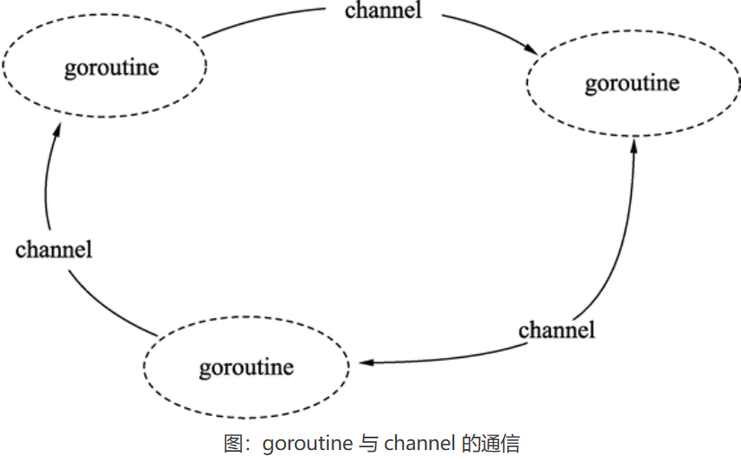

# Go语言通道（chan）——goroutine之间通信的管道

如果说 goroutine 是 Go语言程序的并发体的话，那么 channels 就是它们之间的通信机制。一个 channels 是一个通信机制，它可以让一个 goroutine 通过它给另一个 goroutine 发送值信息。每个 channel 都有一个特殊的类型，也就是 channels 可发送数据的类型。一个可以发送 int 类型数据的 channel 一般写为 chan int。

Go语言提倡使用通信的方法代替共享内存，当一个资源需要在 goroutine 之间共享时，通道在 goroutine 之间架起了一个管道，并提供了确保同步交换数据的机制。声明通道时，需要指定将要被共享的数据的类型。可以通过通道共享内置类型、命名类型、结构类型和引用类型的值或者指针。

**这里通信的方法就是使用通道（channel）**



在地铁站、食堂、洗手间等公共场所人很多的情况下，大家养成了排队的习惯，目的也是避免拥挤、插队导致的低效的资源使用和交换过程。代码与数据也是如此，多个 goroutine 为了争抢数据，势必造成执行的低效率，使用队列的方式是最高效的，**channel 就是一种队列一样的结构。**

## 通道的特性

Go语言中的通道（channel）是一种特殊的类型。在任何时候，同时只能有一个 goroutine 访问通道进行发送和获取数据。goroutine 间通过通道就可以通信

通道像一个传送带或者队列，总是遵循==先入先出==（First In First Out）的规则，保证收发数据的顺序。

## 声明通道类型

通道本身需要一个类型进行修饰，就像切片类型需要标识元素类型。通道的元素类型就是在其内部传输的数据类型，声明如下：

```go
var 通道变量 chan 通道类型
```

- 通道类型：通道内的数据类型。
- 通道变量：保存通道的变量。

chan 类型的空值是 nil，声明后需要配合 make 后才能使用。

## 创建通道

通道是引用类型，需要使用 make 进行创建，格式如下：

```go
通道实例 := make(chan 数据类型)
```

- 数据类型：通道内传输的元素类型。
- 通道实例：通过make创建的通道句柄。

请看下面的例子：

```go
ch1 := make(chan int)                 // 创建一个整型类型的通道
ch2 := make(chan interface{})         // 创建一个空接口类型的通道, 可以存放任意格式
type Equip struct{ /* 一些字段 */ }
ch2 := make(chan *Equip)             // 创建Equip指针类型的通道, 可以存放*Equip
```

## 带缓存的信道

信道可以是 *带缓冲的*。将缓冲长度作为第二个参数提供给 `make` 来初始化一个带缓冲的信道：

```go
ch := make(chan int, 100)
```

仅当信道的缓冲区填满后，向其发送数据时才会阻塞。当缓冲区为空时，接受方会阻塞。

## 使用通道发送数据

通道创建后，就可以使用通道进行发送和接收操作。

#### 1) 通道发送数据的格式

通道的发送使用特殊的操作符`<-`(信道操作符），将数据通过通道发送的格式为：

```go
通道变量 <- 值
```

- 通道变量：通过make创建好的通道实例。
- 值：可以是变量、常量、表达式或者函数返回值等。值的类型必须与ch通道的元素类型一致。

#### 2) 通过通道发送数据的例子

使用 make 创建一个通道后，就可以使用`<-`向通道发送数据，代码如下：

```go
// 创建一个空接口通道
ch := make(chan interface{})
// 将0放入通道中ch <- 0
// 将hello字符串放入通道中
ch <- "hello"
```

#### 3) 发送将持续阻塞直到数据被接收

把数据往通道中发送时，如果接收方一直都没有接收，那么发送操作将持续阻塞。Go 程序运行时能智能地发现一些永远无法发送成功的语句并做出提示，代码如下：

```go
package main
func main() {    
    // 创建一个整型通道    
    ch := make(chan int)    
    // 尝试将0通过通道发送    
    ch <- 0
}
```

运行代码，报错：

```go
fatal error: all goroutines are asleep - deadlock!
```

报错的意思是：运行时发现所有的 goroutine（包括main）都处于等待 goroutine。也就是说所有 goroutine 中的 channel 并没有形成发送和接收对应的代码。

## 使用通道接收数据

通道接收同样使用`<-`操作符，通道接收有如下特性：
① 通道的收发操作在不同的两个 goroutine 间进行。

由于通道的数据在没有接收方处理时，数据发送方会持续阻塞，因此通道的接收必定在另外一个 goroutine 中进行。

② 接收将持续阻塞直到发送方发送数据。

如果接收方接收时，通道中没有发送方发送数据，接收方也会发生阻塞，直到发送方发送数据为止。

③ 每次接收一个元素。
通道一次只能接收一个数据元素。

通道的数据接收一共有以下 4 种写法。

#### 1) 阻塞接收数据

阻塞模式接收数据时，将接收变量作为`<-`操作符的左值，格式如下：

```go
data := <-ch
```

执行该语句时将会阻塞，直到接收到数据并赋值给 data 变量。

#### 2) 非阻塞接收数据

使用非阻塞方式从通道接收数据时，语句不会发生阻塞，格式如下：

```go
data, ok := <-ch
```

- data：表示接收到的数据。未接收到数据时，data 为通道类型的零值。
- ok：表示是否接收到数据。

非阻塞的通道接收方法可能造成高的 CPU 占用，因此使用非常少。如果需要实现接收超时检测，可以配合 select 和计时器 channel 进行，可以参见后面的内容。


#### 3) 接收任意数据，忽略接收的数据

阻塞接收数据后，忽略从通道返回的数据，格式如下：

```go
<-ch
```

执行该语句时将会发生阻塞，直到接收到数据，但接收到的数据会被忽略。这个方式实际上只是通过通道在 goroutine 间阻塞收发实现并发同步。

使用通道做并发同步的写法，可以参考下面的例子：

```go
package main

import (
    "fmt"
)

func main() {

    // 构建一个通道
    ch := make(chan int)

    // 开启一个并发匿名函数
    go func() {

        fmt.Println("start goroutine")

        // 通过通道通知main的goroutine
        ch <- 0

        fmt.Println("exit goroutine")

    }()

    fmt.Println("wait goroutine")

    // 等待匿名goroutine
    <-ch

    fmt.Println("all done")

}
//一般来说，goroutines 之间的执行顺序是不确定的，但在这种情况下，通过通道的同步机制确保了 "wait goroutine" 在 "start goroutine" 之后打印。
```

执行代码，输出如下：

```go
wait goroutine
start goroutine
exit goroutine
all done
```

代码说明如下：

- 第 10 行，构建一个同步用的通道。
- 第 13 行，开启一个匿名函数的并发。
- 第 18 行，匿名 goroutine 即将结束时，通过通道通知 main 的 goroutine，这一句会一直阻塞直到 main 的 goroutine 接收为止。
- 第 27 行，开启 goroutine 后，马上通过通道等待匿名 goroutine 结束。

#### 4) 循环接收

通道的数据接收可以借用 for range 语句进行多个元素的接收操作，格式如下：

```
for data := range ch {}
```

通道 ch 是可以进行遍历的，遍历的结果就是接收到的数据。数据类型就是通道的数据类型。通过 for 遍历获得的变量只有一个，即上面例子中的 data。

遍历通道数据的例子请参考下面的代码。

使用 for 从通道中接收数据：

```go
package main

import (
    "fmt"
    "time"
)

func main() {
    // 构建一个通道
    ch := make(chan int)
    // 开启一个并发匿名函数
    go func() {
        // 从3循环到0
        for i := 3; i >= 0; i-- {
            // 发送3到0之间的数值
            ch <- i
            // 每次发送完时等待
            time.Sleep(time.Second)
        }

    }()

    // 遍历接收通道数据
    for data := range ch {
        // 打印通道数据
        fmt.Println(data)
        // 当遇到数据0时, 退出接收循环
        if data == 0 {
                break
        }
    }

}
```

执行代码，输出如下：

```go
3
2
1
0
```

代码说明如下：

- 第 12 行，通过 make 生成一个整型元素的通道。
- 第 15 行，将匿名函数并发执行。
- 第 18 行，用循环生成 3 到 0 之间的数值。
- 第 21 行，将 3 到 0 之间的数值依次发送到通道 ch 中。
- 第 24 行，每次发送后暂停 1 秒。
- 第 30 行，使用 for 从通道中接收数据。
- 第 33 行，将接收到的数据打印出来。
- 第 36 行，当接收到数值 0 时，停止接收。如果继续发送，由于接收 goroutine 已经退出，没有 goroutine 发送到通道，因此运行时将会触发宕机报错。

# range和close

发送者可通过 `close` 关闭一个信道来表示没有需要发送的值了。接收者可以通过为接收表达式分配第二个参数来测试信道是否被关闭：若没有值可以接收且信道已被关闭，那么在执行完

```
v, ok := <-ch
```

之后 `ok` 会被设置为 `false`。

循环 `for i := range c` 会不断从信道接收值，直到它被关闭。

*注意：* 只有发送者才能关闭信道，而接收者不能。向一个已经关闭的信道发送数据会引发程序恐慌（panic）。

*还要注意：* 信道与文件不同，通常情况下无需关闭它们。只有在必须告诉接收者不再有需要发送的值时才有必要关闭，例如终止一个 `range` 循环。

# select语句

`select` 语句使一个 Go 程可以等待多个通信操作。

`select` 会阻塞到某个分支可以继续执行为止，这时就会执行该分支。当多个分支都准备好时会随机选择一个执行。

```go
package main

import "fmt"

func fibonacci(c, quit chan int) {
	x, y := 0, 1
	for {
		select {
		case c <- x:
			x, y = y, x+y
		case <-quit:
			fmt.Println("quit")
			return
		}
	}
}

func main() {
	c := make(chan int)
	quit := make(chan int)
	go func() {
		for i := 0; i < 10; i++ {
			fmt.Println(<-c)
		}
		quit <- 0
	}()
	fibonacci(c, quit)
}

```

## 默认选择

当 `select` 中的其它分支都没有准备好时，`default` 分支就会执行。

为了在尝试发送或者接收时不发生阻塞，可使用 `default` 分支：

```go
select {
case i := <-c:
    // 使用 i
default:
    // 从 c 中接收会阻塞时执行
}
```

# sync.Mutex

我们已经看到信道非常适合在各个 Go 程间进行通信。

但是如果我们并不需要通信呢？比如说，若我们只是想保证每次只有一个 Go 程能够访问一个共享的变量，从而避免冲突？

这里涉及的概念叫做 *互斥（mutual*exclusion）* ，我们通常使用 *互斥锁（Mutex）* 这一数据结构来提供这种机制。

Go 标准库中提供了 [`sync.Mutex`](https://go-zh.org/pkg/sync/#Mutex) 互斥锁类型及其两个方法：

- `Lock`
- `Unlock`

我们可以通过在代码前调用 `Lock` 方法，在代码后调用 `Unlock` 方法来保证一段代码的互斥执行。参见 `Inc` 方法。

我们也可以用 `defer` 语句来保证互斥锁一定会被解锁。参见 `Value` 方法。

```go
package main

import (
	"fmt"
	"sync"
	"time"
)

// SafeCounter 的并发使用是安全的。
type SafeCounter struct {
	v   map[string]int
	mux sync.Mutex
}

// Inc 增加给定 key 的计数器的值。
func (c *SafeCounter) Inc(key string) {
	c.mux.Lock()
	// Lock 之后同一时刻只有一个 goroutine 能访问 c.v
	c.v[key]++
	c.mux.Unlock()
}

// Value 返回给定 key 的计数器的当前值。
func (c *SafeCounter) Value(key string) int {
	c.mux.Lock()
	// Lock 之后同一时刻只有一个 goroutine 能访问 c.v
	defer c.mux.Unlock()
	return c.v[key]
}

func main() {
	c := SafeCounter{v: make(map[string]int)}
	for i := 0; i < 1000; i++ {
		go c.Inc("somekey")
	}

	time.Sleep(time.Second)
	fmt.Println(c.Value("somekey"))
}

```

// 执行结果

```go
1000

```

