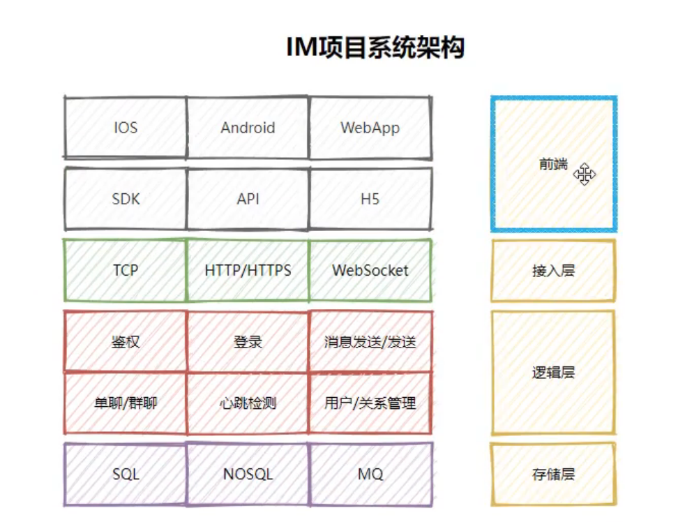

# Gin+WebSocket项目实战IM

API： https://gin-gonic.com/zh-cn/docs/

## 需求分析：

### 项目目的：

项目背景：IM对性能和体验敏感度非常高。大厂必备

### 你将获得什么：

熟悉开发流程，熟练相关技术栈gin+GORM+swagger+logrus auth等中间件，三高性能

### 核心功能：

发送和接收消息，文字 表情 图片 音频，访客， 点对点， 群聊， 广播， 快捷回复， 撤回，心跳检测........

### 技术栈：

前端（CSS，HTML5，JS ......）

后端（webSocket,  channel/goroutine,  gin,  temlate,  gorm,  sql,  nosql,  mq......）

