常见CMD命令：
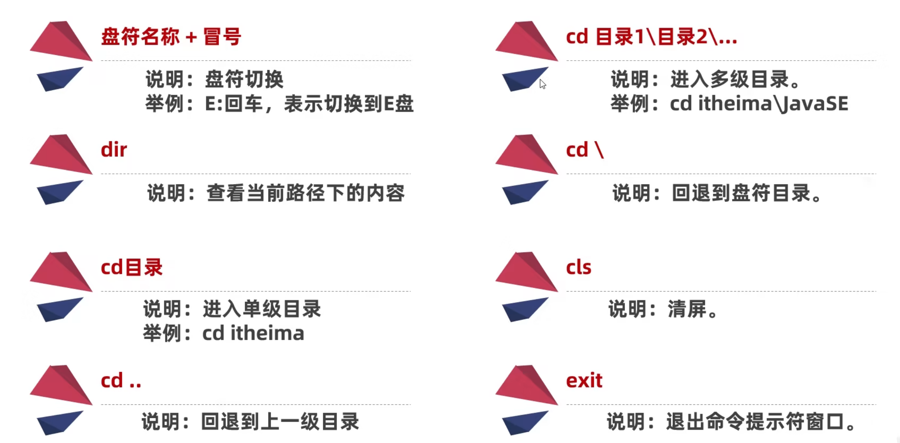

java跨平台的原理

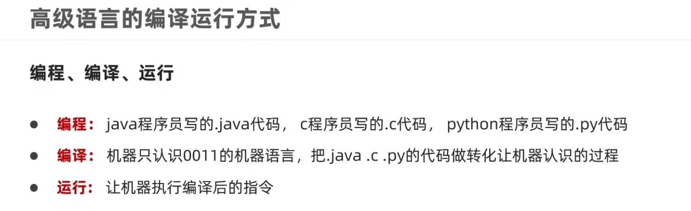

Java跨平台是通过虚拟机来实现的。

JVM：Java虚拟机，真正运行Java程序的地方

javac编译工具， java运行工具，jhat内存分析工具，jdb调试工具

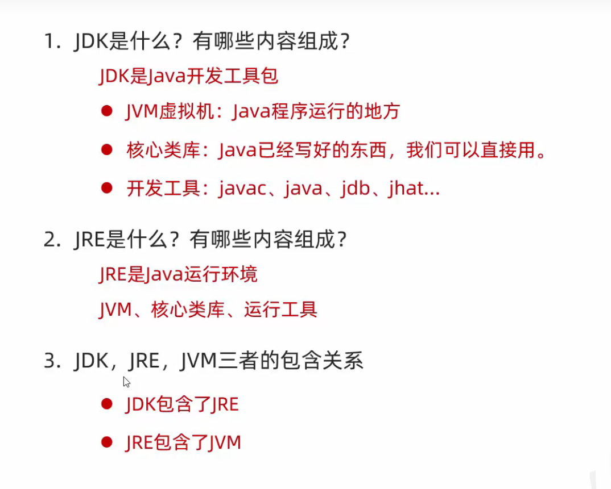

# java中的面向对象


## 封装

原则：对象代表什么，就得封装对应的数据，并提供数据对应的行为

private关键字，


## JavaBean

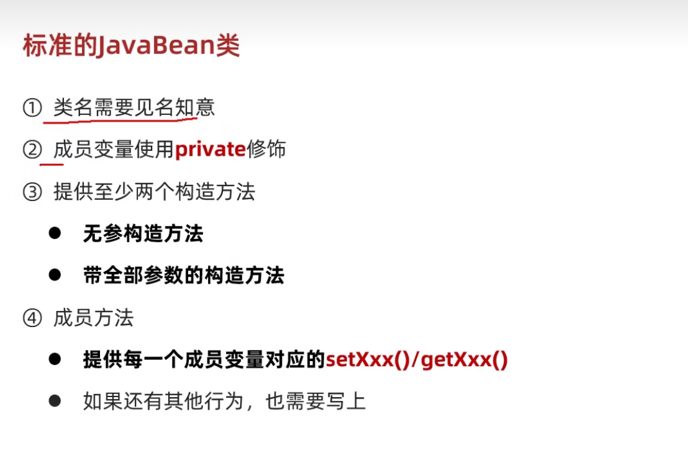

## 字符串

String， StringBuilder，StringJoiner


## 集合

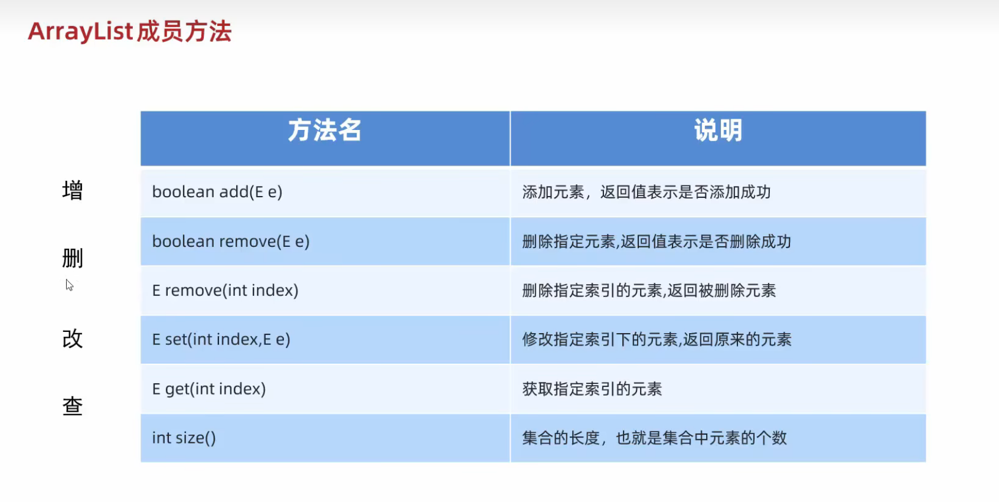

## static

static是静态的意思，

可以用这个来定义静态的变量和方法，静态变量被所有类对象共享，静态方法被所有方法共享

注意的点：

- 静态变量一般用public修饰，用类名直接点出来初始化。
- 静态方法没有this指针
- 静态不能调用非静态方法
- 非静态方法有一个隐藏的this指针


​				

## 封装，继承，多态

### 封装

对象代表什么，就得封装对应的数据，并提供数据对应的行为

### 继承

Java中提供了一个关键字`extends`，用这个关键字，我们我可以让一个类和另一个类建立起继承关系

```java
public class Student extends Person{}
```

Student称为子类（派生类），Person称为父类（基类或超类）


> 当类与类之间，存在相同的内容，并且满足子类是父类的一种，就可以考虑继承，来优化代码。

有些是能继承的有些是不能继承的

|   构造方法   |    public 不能    |    private不能     |
| :----------: | :---------------: | :----------------: |
| **成员变量** | **==public 能==** | **==private 能==** |
| **成员方法** | ==**public 能**== |  **private 不能**  |

Java 只支持单继承（只能继承一个父类），不支持多继承，但支持多层继承

每一个类都直接或间接继承与object；

只有父类中的虚方法才能被子类继承；

> 虚方法：非private修饰的，非static修饰的，非final修饰的

继承中变量和方法访问的特点：就近原则；

`this`指针会现在本类中查看，然后再查看父类继承的方法；

`super`指针会直接调用父类中的方法

如果父类的方法不能满足子类现在的需求时，就需要方法重写，

**@Override重写注解** ：放在重写后的方法上，效验子类重写时语法是否正确；

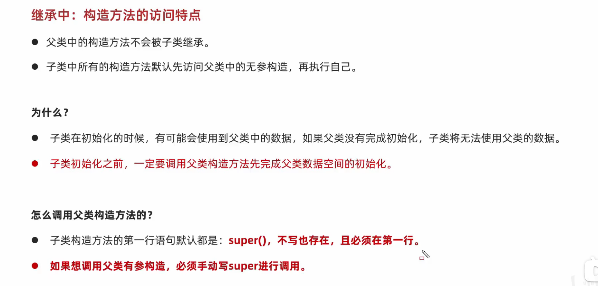

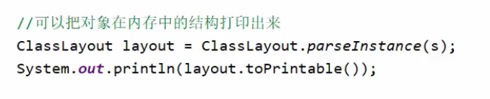

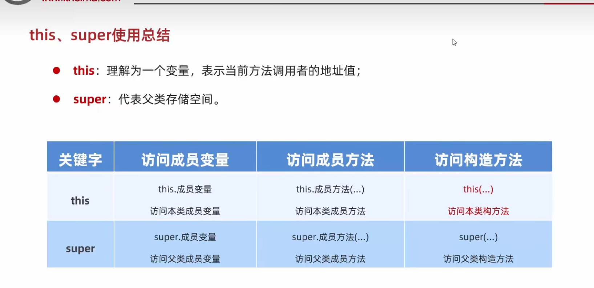


### 多态

继承是多态的前提条件，没有继承就没有多态。


表现形式：父类类型 对象名称 = 子类对象；

前提： 有继承关系，有父类引用指向子类对象，有方法重写。


**好处**：使用父类型作为参数，可以接受所有子类对象，体现多态的扩展性和便利。


多态调用成员的特点：

- 变量调用：编译看左边，运行看左边。
- 方法调用：编译看左边，运行看右边。


**弊端**：不能调用子类的特有功能；

解决方案：把调用者变回子类类型就可以了。

可以使用instanceof来判断类型；

```java
if(a instanceof Dog) // 判断a类型是不是dog类型，都是类
```

Java14后的新特性

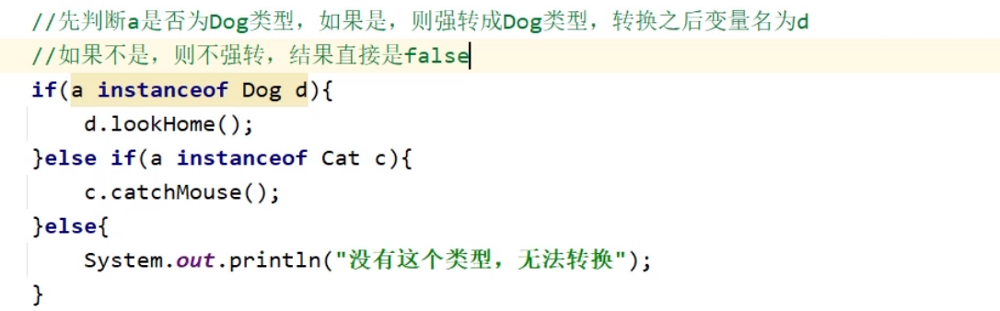

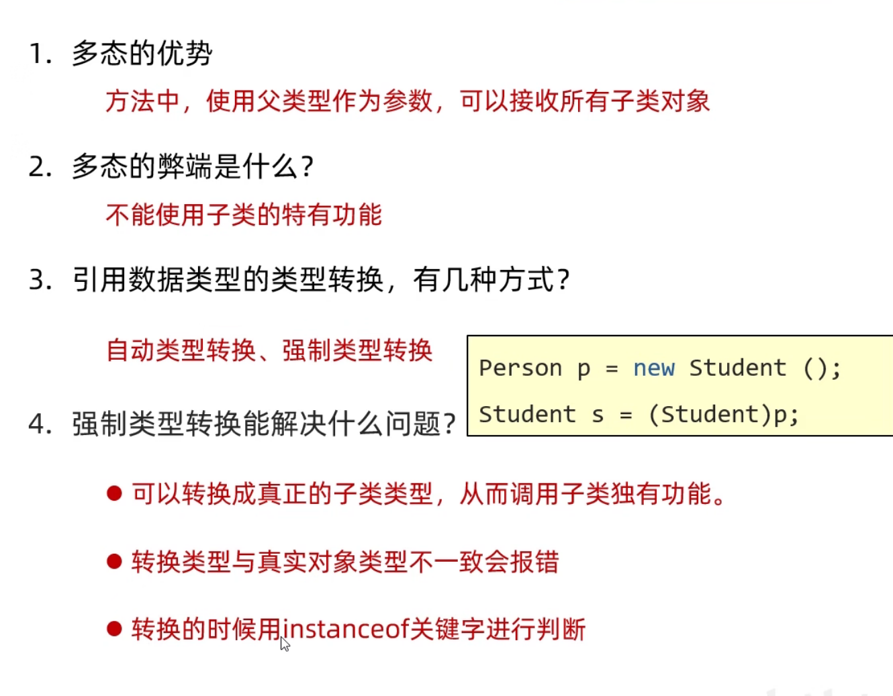

# 包


包就是文件夹，用来管理各种不同功能的Java类，方便后期代码维护。

包名的规则：公司域名反写+包的作用，**需要全部英文小写**，见名知意。

如果要使用两个包中的同名类，就要使用全类名（包名+类名）；

# final

最终的。不可被改变的

可以修饰方法，类，变量；

方法：是最终方法，不能被重写；

类：最终类，不能被继承；

变量：常量，只能被赋值一次。

## 常量

一般作为系统的配置信息，方便维护，提高可读性。

命名规范：大写字母，用下划线隔开。

# 权限修饰符

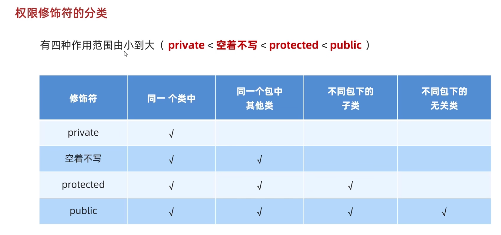

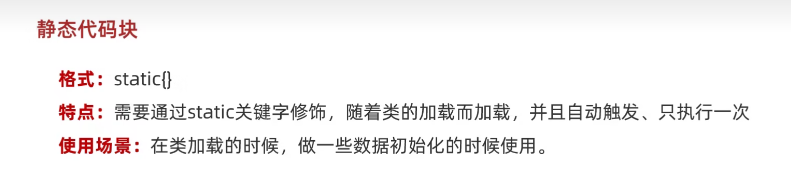

# 抽象类

abstract修饰的方法，子类必须重写。

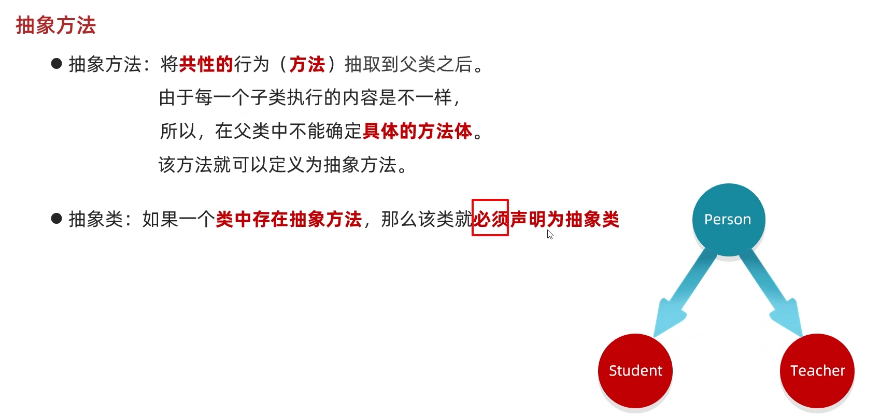

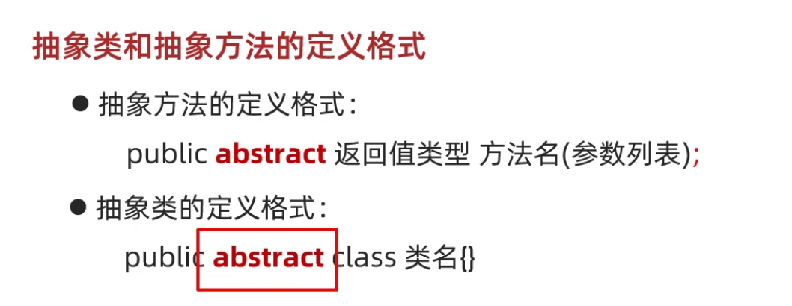

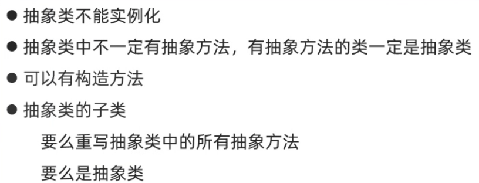


# 接口

就是一种规则。interface；

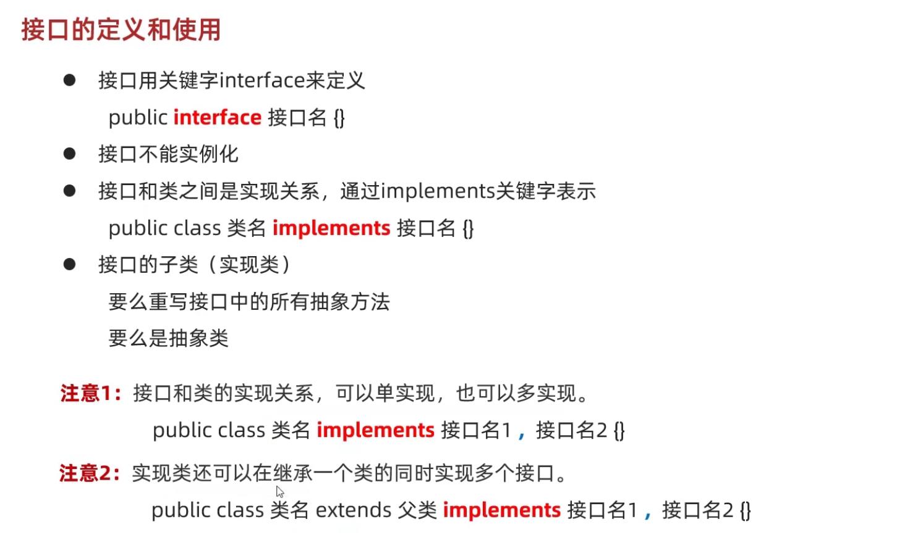

接口中成员的特点：

成员变量：只能是常量，默认用static和final修饰；

没有构造方法

## JDK8开始接口中新增的方法

JDK7前：接口中只能定义抽象方法。

JDK8新特性：接口中可以定义有方法体的方法。（默认，静态）用default修饰，用于解决接口升级的问题。

JDK9新特性：接口中可以定义私有方法。

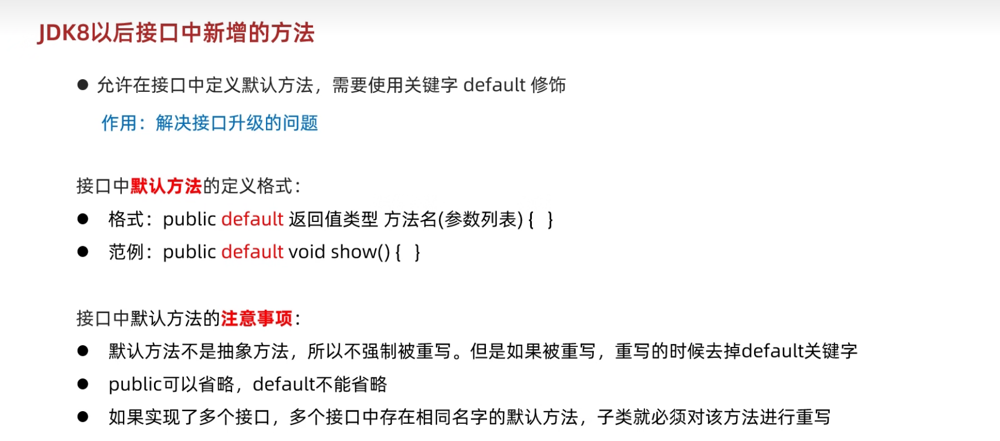

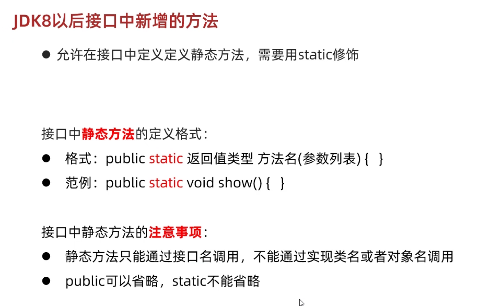

**接口多态** ： 当一个方法的参数是接口时，可以传递接口所有实现类的对象，这种方式称之为接口多态。

# 内部类

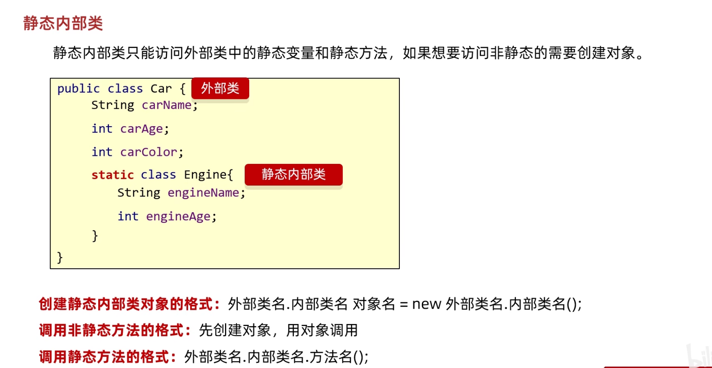

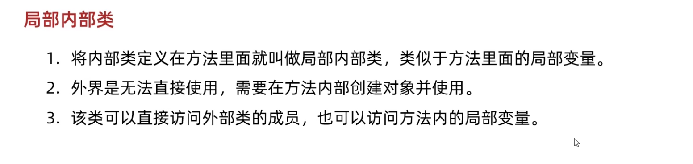

 ## 匿名内部类

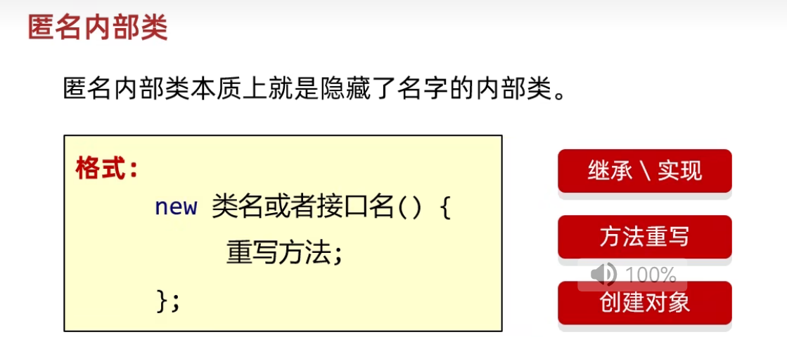

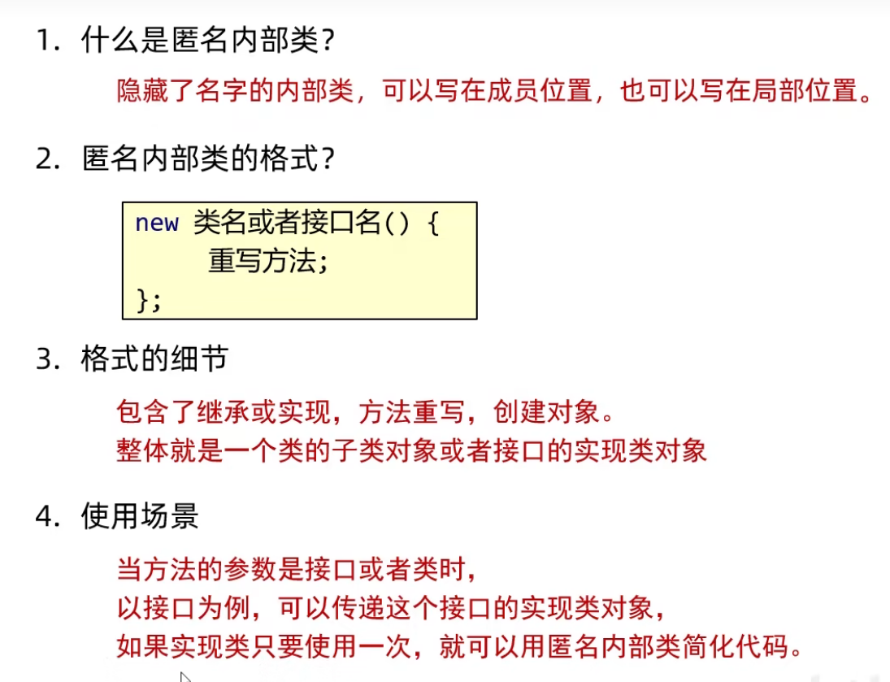


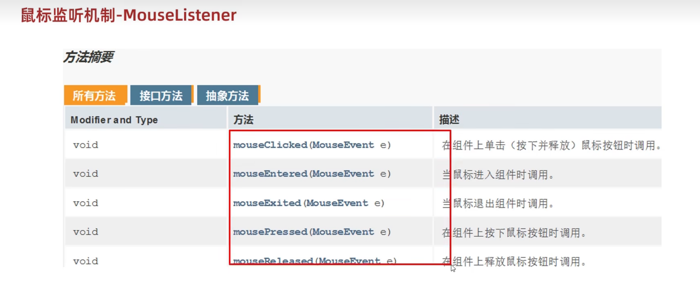

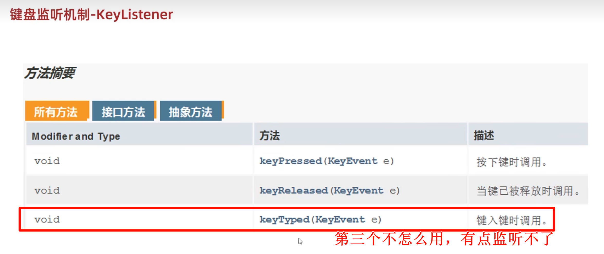
