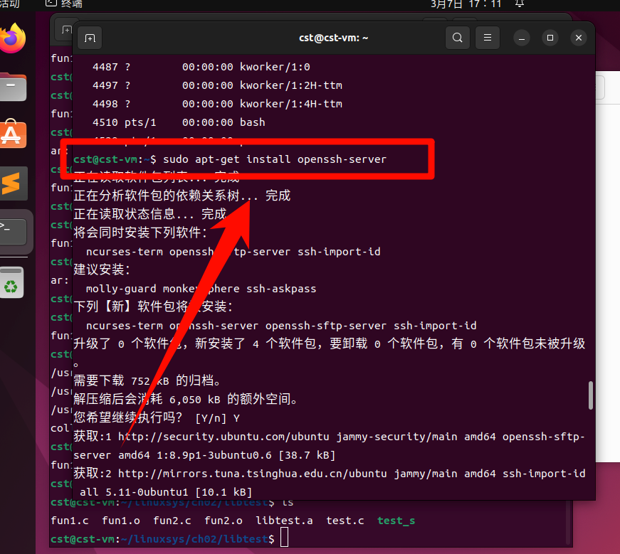
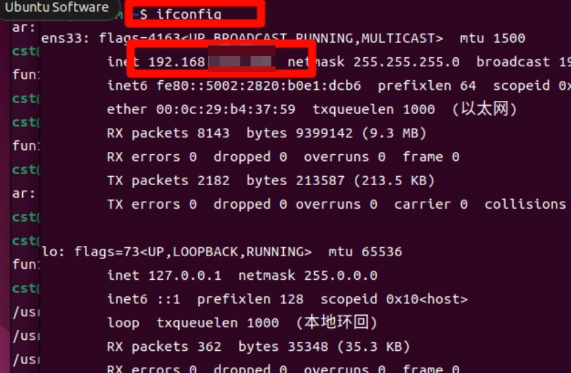
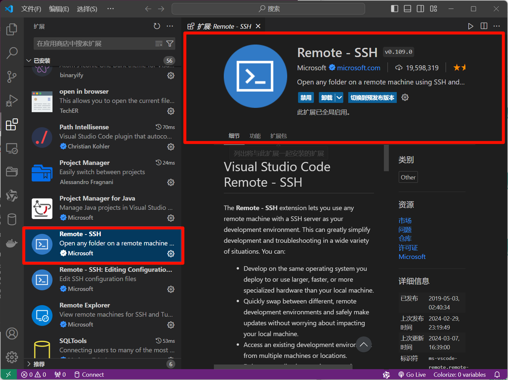
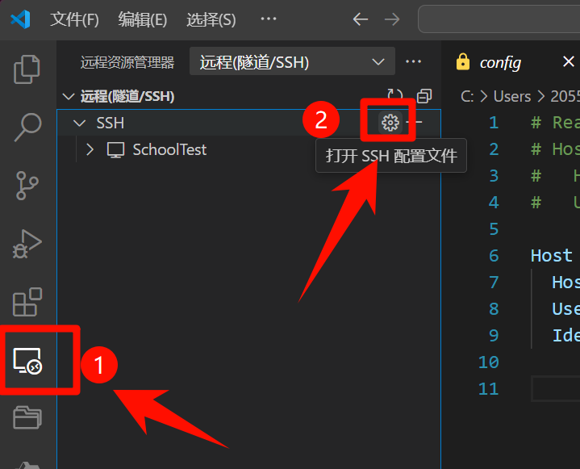
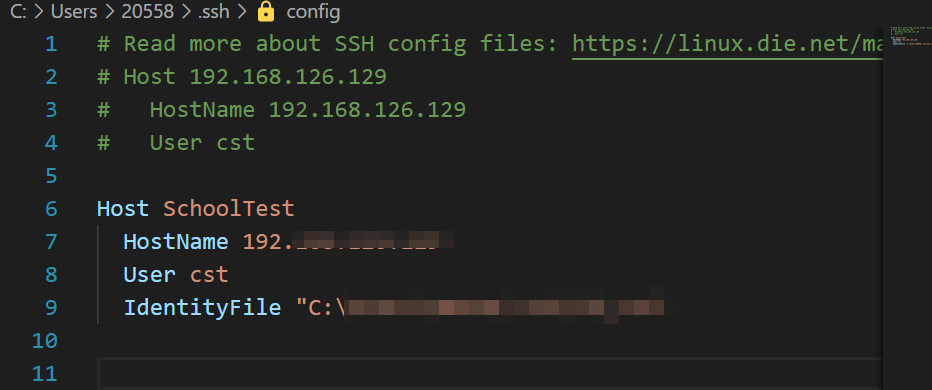
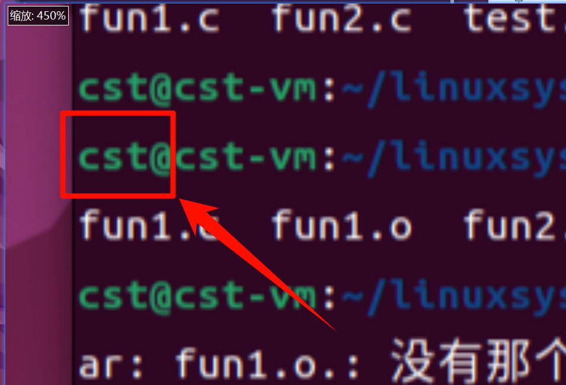
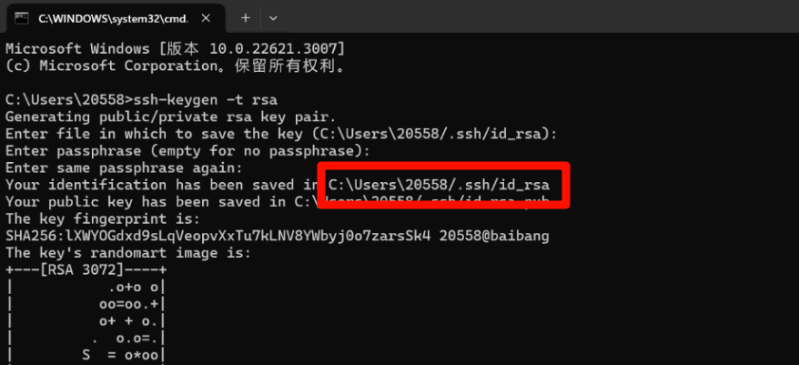
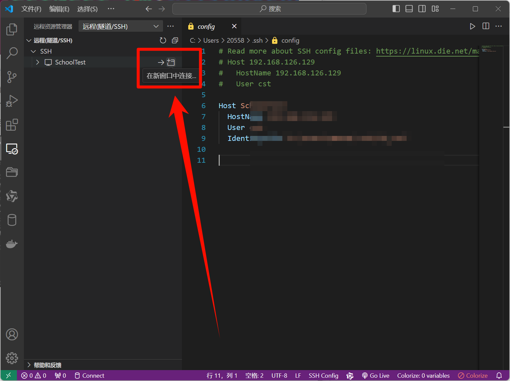

# VS Code使用ssh远程连接Ubuntu

需要事先打开虚拟机

然后才能使用VsCode连接

在虚拟机中使用这条命令，安装ssh服务

在Linux中使用`ifconfig`命令查看虚拟机的IP地址：

然后打开VsCode ， 安装插件

安装后打开，进行添加：

打开设置后，添加设置

`Host` 随便写，就是个名字

`HostName` 是虚拟机的IP地址，就是前面用ifconfig获取的地址

`User`就是虚拟机的用户名，就是在虚拟机终端中@前面的那个

`IdentityFile `可以不用填写

不填的话每次使用都需要输入密码，要填的话在Windows中打开终端，使用`ssh-keygen -t rsa` 获取一个密钥，然后把地址填在后面。

输入命令后，一直点回车，直到出现下图的东西。

然后点击，下图位置，启动虚拟机，进去后悬着Linux，然后根据提示输入虚拟机的用户密码

然后就可以正常使用了，新建立终端也是直接用的Linux的终端。