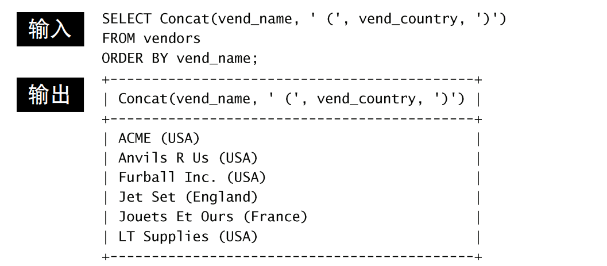
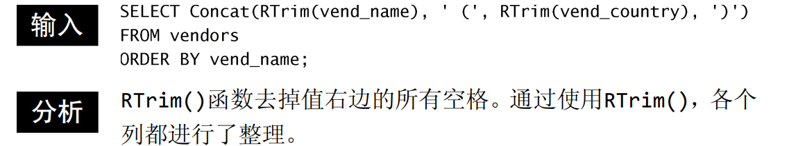

计算字段并不实际存在于数据库表中。==计算字段是运行时在SELECT语句内创建的==。

**字段**：基本上与列的意思相同，经常互换使用，不过数据库列一般为列，而术语字段通常用在计算字段的连接上。

# 拼接字段

举一个例子来说这个问题，要创建一个由两列组成的标题，第一个表包含名字和位置信息，需要在名字中按照name(location)，这样的格式来列出，次表需要单个值，而表中的数据存储在两个列中。

那么，怎么返回名字和位置的select语句呢？

使用**拼接**，将值联结到一起构成单个值。

在MySQL中，可使用Concat()函数来拼接两个列。

> 多数的数据库语言使用+或||来实现拼接，但MySQL使用函数。

Concat()拼接串，即把多个串连接起来形成一个较长的串。

使用过程中需要一个或多个指定的串，各个串之间使用逗号分隔。

>前面的笔记中提到过可以通过删除数据右侧多余的空格来整理数据，这可以使用RTrim()函数来完成。

>MySQL除了支持RTrim()（正如刚才所见，它去掉 串右边的空格），还支持LTrim()（去掉串左边的空格）以及 Trim()（去掉串左右两边的空格）。

==**使用别名**==：

