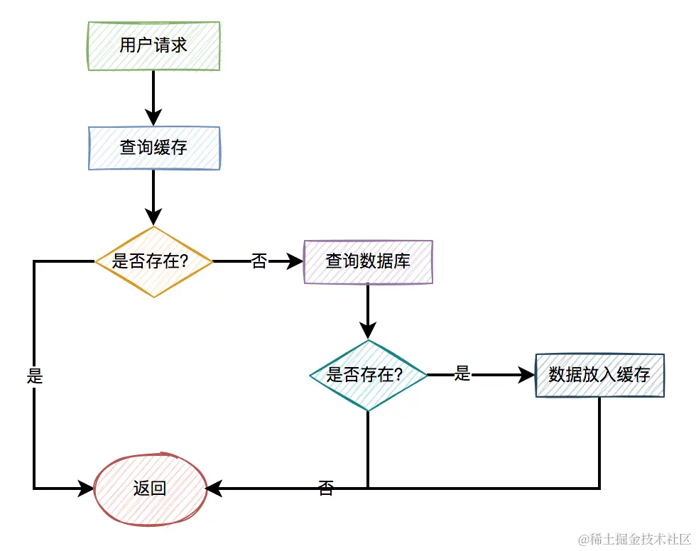

# 1. 统计访问次数

对于很多官方网站的首页，通常会有一些统计首页次数的需求。

而访问次数只有一个字段，如果保存到数据库中，再最后做汇总有些麻烦。

该业务场景可以使用Redis，定义一个Key， 比如： `INDEX_VISIT_COUNT`

在Redis中有 incr 命令， 可以实现给value值 加1 的操作：

```sql
incr INDEX_VISIT_COUNT
```

当然如果你想一次加的值大于1， 可以用 incrby 命令， 例如：

```sql
incrby INDEX_VISIT_COUNT 5
```

这样可以一次性加 5 。


# 2. 获取分类树

在很多网站都有分类树的功能，如果没有生成静态的html页面， 想通过调用接口的方式获取分类树的数据。

为了性能考虑，会将分类树的 json 数据缓存到Rdis当中， 为了后面在网站中能够快速获取数据

不然在接口中需要使用递归查询数据库，让后 拼接 成 分类树 的数据结构。

但是， 这个过程非常麻烦， 而且需要多次查询数据库， 性能很差。

因此，可以考虑用一个定时任务， 异步将分类树的数据， 直接的缓存到Rdis中，定义一个 key， 然后接口中直接使用这个key从缓存中获取数据即可。 可以直接用 key / value字符串保存数据。

不过， 如果分类树的数据非常多， 就会出现大key问题，需要进行优化。


# 3. 做分布式锁

这可能是Redis使用最常见的 场景之一， 相对于其他的分布式锁， 比如： 数据库分布式锁或者Zookeeper分布式锁， 基于Rdis的分布式锁，有更好的性能， 被广泛使用于实际工作中。

我们使用下面这段代码可以加锁：

```kotlin
try{
  String result = jedis.set(lockKey, requestId, "NX", "PX", expireTime);
  if ("OK".equals(result)) {
      return true;
  }
  return false;
} finally {
    unlock(lockKey);
}  
```

但上面这段代码在有些场景下，会有一些问题，释放锁可能会释放了别人的锁。

说实话Redis分布式锁虽说很常用，但坑也挺多的，如果用不好的话，很容易踩坑。

如果大家对Redis分布式锁的一些坑比较感兴趣，可以看看我的另一篇文章《[聊聊redis分布式锁的8大坑](https://link.juejin.cn?target=https%3A%2F%2Fmp.weixin.qq.com%2Fs%3F__biz%3DMzkwNjMwMTgzMQ%3D%3D%26mid%3D2247490430%26idx%3D1%26sn%3Da1f42f9a981a8f161941a6472f317b10%26chksm%3Dc0ebc396f79c4a801a330917ca700e7d7a6af3a3c2c5a4e11a05770da925de8aa9ed3c277737%26token%3D795379312%26lang%3Dzh_CN%26scene%3D21%23wechat_redirect)》，文章中有非常详细的介绍。

# 4. 做排行榜

很多网站有排行榜的功能，比如：商城中有商品销量的排行榜，游戏网站有玩家获得积分的排行榜。

通常情况下，我们可以使用`Sorted Set`保存排行榜的数据。

使用`ZADD`可以添加排行榜的数据，使用`ZRANGE`可以获取排行榜的数据。

例如：

```arduino
ZADD rank:score 100 "周星驰"
ZADD rank:score 90 "周杰伦"
ZADD rank:score 80 "周润发"
ZRANGE rank:score 0 -1 WITHSCORES
```

返回数据：

```arduino
1) "周星驰"
2) "100"
3) "周杰伦"
4) "90"
5) "周润发"
6) "80"
```

## 5. 记录用户登录状态

通常下，用户登录成功之后，用户登录之后的状态信息，会保存到Redis中。

这样后面该用户访问其他接口的时候，会直接从Redis中查询用户登录状态，如果可以查到数据，说明用户已登录，则允许做后续的操作。

如果从Redis中没有查到用户登录状态，说明该用户没有登录，或者登录状态失效了，则直接跳转到用户登录页面。

使用Redis保存用户登录状态，有个好处是它可以设置一个过期时间，比如：该时间可以设置成30分钟。

```c
jedis.set(userId, userInfo, 1800);
```

在Redis内部有专门的job，会将过期的数据删除，也有获取数据时实时删除的逻辑。

## 6. 限流

使用Redis还有一个非常常用的的业务场景是`做限流`。

当然还有其他的限流方式，比如：使用nginx，但使用Redis控制可以更精细。

比如：限制同一个ip，1分钟之内只能访问10次接口，10分钟之内只能访问50次接口，1天之内只能访问100次接口。

如果超过次数，则接口直接返回：请求太频繁了，请稍后重试。

跟上面保存用户登录状态类似，需要在Redis中保存用户的请求记录。

比如：key是用户ip，value是访问的次数从1开始，后面每访问一次则加1。

如果value超过一定的次数，则直接拦截这种异常的ip。

当然也需要设置一个过期时间，异常ip如果超过这个过期时间，比如：1天，则恢复正常了，该ip可以再发起请求了。

或者限制同一个用户id。

## 7. 位统计

比如现在有个需求：有个网站需要统计一周内连续登陆的用户，以及一个月内登陆过的用户。

这个需求使用传统的数据库，实现起来比较麻烦，但使用Redis的`bitmap`让我们可以实时的进行类似的统计。

bitmap 是二进制的byte数组，也可以简单理解成是一个普通字符串。它将二进制数据存储在byte数组中以达到存储数据的目的。

保存数据命令使用setbit，语法：

```sql
setbit key offset value
```

具体示例：

```sql
sql
复制代码setbit user:view:2024-01-17 123456 1
```

往bitmap数组中设置了用户id=123456的登录状态为1，标记2024-01-17已登录。

然后通过命令getbit获取数据，语法：

```sql
getbit key offset
```

具体示例：

```sql
getbit user:view:2024-01-17 123456
```

如果获取的值是1，说明这一天登录了。

如果我们想统计一周内连续登录的用户，只需要遍历用户id，根据日期中数组中去查询状态即可。

## 8. 缓存加速

我们在工作中使用Redis作为缓存加速，这种用法也是非常常见的。

如果查询订单数据，先从Redis缓存中查询，如果缓存中存在，则直接将数据返回给用户。

如果缓存中不存在，则再从数据库中查询数据，如果数据存在，则将数据保存到缓存中，然后再返回给用户。

如果缓存和数据库都不存在，则直接给用户返回数据不存在。

流程图如下：但使用缓存加速的业务场景，需要注意一下，可能会出现：缓存击穿、穿透和雪崩等问题，感兴趣的小伙伴，可以看看我的另一篇文章《[烂大街的缓存穿透、缓存击穿和缓存雪崩，你真的懂了？](https://link.juejin.cn?target=https%3A%2F%2Fmp.weixin.qq.com%2Fs%3F__biz%3DMzkwNjMwMTgzMQ%3D%3D%26mid%3D2247491225%26idx%3D1%26sn%3Dbfb14f28911efaa6e3a615870fff9a5c%26chksm%3Dc0ebc671f79c4f6718a63bbec91d79a4b05e1dd2a7c00ed9bf6a9f582abd4c6e5c870148ff89%26token%3D795379312%26lang%3Dzh_CN%26scene%3D21%23wechat_redirect)》，里面有非常详细的介绍。

## 9. 做消息队列

我们说起队列经常想到是：kafka、rabbitMQ、RocketMQ等这些分布式消息队列。

其实Redis也有消息队列的功能，我们之前有个支付系统，就是用的Redis队列功能。

PubSub(发布订阅)是Redis2.0版本引入的消息传递模型。

顾名思义，消费者可以订阅一个或多个channel，生产者向对应channel发送消息后，所有订阅者都能收到相关消息。对应channel发送消息后，所有订阅者都能收到相关消息。

在java代码中可以实现MessageListener接口，来消费队列中的消息。

```typescript
@Slf4j
@Component
public class RedisMessageListenerListener implements MessageListener {
    @Autowired
    private RedisTemplate<String, Object> redisTemplate;

    @Override
    public void onMessage(Message message, byte[] pattern) {
        String channel = new String(pattern);
        RedisSerializer<?> valueSerializer = redisTemplate.getValueSerializer();
        Object deserialize = valueSerializer.deserialize(message.getBody());
        if (deserialize == null) return;
        String md5DigestAsHex = DigestUtils.md5DigestAsHex(deserialize.toString().getBytes(StandardCharsets.UTF_8));
        Boolean result = redisTemplate.opsForValue().setIfAbsent(md5DigestAsHex, "1", 20, TimeUnit.SECONDS);
        if (Boolean.TRUE.equals(result)) {
            log.info("接收的结果：{}", deserialize.toString());
        } else {
            log.info("其他服务处理中");
        }
    }
}
```

## 10. 生成全局ID

在有些需要生成全局ID的业务场景，其实也可以使用Redis。

可以使用incrby命令，利用原子性操作，可以执行下面这个命令：

```
incrby userid 10000
```

在分库分表的场景，对于有些批量操作，我们可以从Redis中，一次性拿一批id出来，然后给业务系统使用。

