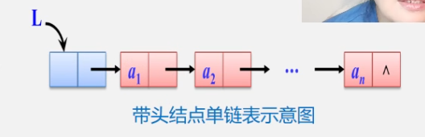
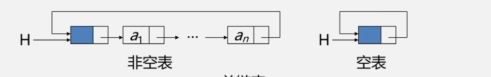
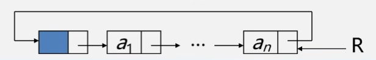
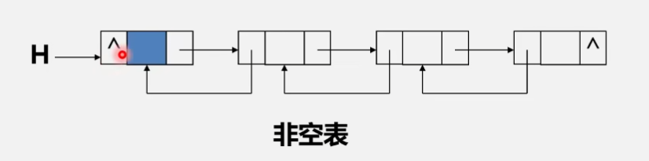
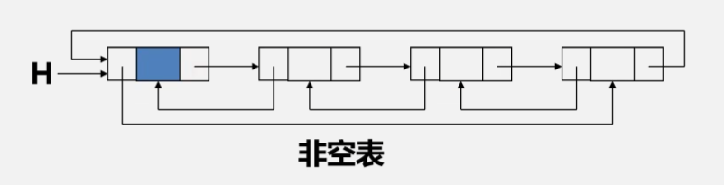
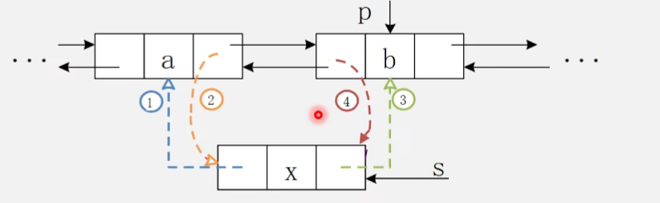

------

[TOC]

------


# 线性表


| 顺序存储结构 |        链式存储结构        |
| :----------: | :------------------------: |
|              | 单链表、循环链表、双向链表 |

线性表的这两种结构是数据结构中其他数据结构的基础。文章后面会详细介绍栈和队列这两种结构；在此之前先简单了解一下线性表的算法结构和思想；

## 顺序存储结构

顺序表差不多像个数组，先构建一个结构，再构建一个**结构数组**，然后从0开始存储数值，可以通过数组的下标访问结构元素，一般顺序结构用来查找和访问，因为修改插入和删除需要移动插入位置后面的所有元素，时间复杂度为O(n)，访问时可以直接通过数组下标找到元素。

## 链式存储结构

### 1.单链表



​	由一个一个节点组成，一个节点中含有数据域和指针域，指针域指向下一个节点。

### 2.静态链表

​	**不重要**：基本用不到，这是科学家为了给没有指针的语言设计的。

### 3.循环链表

​	这是一种头尾相接的链表（即：尾指针指向头节点，整个链表形成一个环）



​	因为循环链表没有NULL指针，故涉及遍历的时候，其终止条件是判断它和它的下一个指针是否是头指针。

由于有指针的存在，它的增删改查的平均时间复杂度为O(1)，查找某数值的平均时间复杂度为O(n)。

还有一种表示方法——尾指针法；如下图，这样查找头节点和尾节点更方便。时间复杂度都是O(1)。



 


### 4.双向链表

做法：在单链表的每个节点里面再增加一个指向其前驱的指针域prior，这样链表就有了两个方向不同的链，故称为双向链表。





双向链表的操作：

**插入**：按顺序改变指针域的指向。

**删除**：先改变前面的next域，再改变prior域。 记得把删除的那个数据地址存储起来，操作完后==释放内存==。

 # 栈

### 一、顺序栈的表示与实现

#### 1.构建顺序栈

```c
define MAXSIZE 100
typedef struct{
    SElemType *base;//栈底指针
    SElemType *top;//栈顶指针
    int stacksize;//栈的可用最大容量
}SqStack;
```

#### 2.顺序栈的初始化

```c++
Status InitStack(SqStack &S){
    S.base = new SElemType[MAXSIZE];
    if(!S.base) exit (OVERFLOW);
    S.top = S.base;
    S.stacksize = MAXSIZE;
}
```

#### 3.判断栈空、求栈长度

编写函数，接受栈，判断top指针和base指针是否相等，相等为空。

`S.top-S.base`就是栈的长度；

#### 4.清空和销毁顺序栈

```c++
Status ClearStack (SqStack S){
    if(S.base)S.top = S.base;
    return OK;
}
/////////////////////////////////
Status DestoryStack(SqStack &S){
	if(S.base){
	delete S.base;
    S.stacksize = 0;
    S.base = S.top = NULL;
    }
    return OK:
}
```

#### 5.顺序栈的入栈和出栈

==**入栈**==：（1）判断是否栈满，若满则错（上溢）

​			（2）元素e压入栈顶

​			（3）栈顶指针加一(top指针始终指向栈顶元素的下一个位置)

```c++
Status Push(SqStack &S,SElemType e){
    if(S.top - S.base == S.stacksize)
        return ERROR;
    *S.top++=e;
    reeutn OK;
}
```

==**出栈**==：先判断栈是否为空，若空则出错，再将top指针下移，获取栈顶元素值，销毁值；

```c
Status Push(SqStack &S,SElemType &e){
    if(S.top == S.base )
        return ERROR;
    e = *--S.top;
    reeutn OK;
}
```

### 二、链栈的表示与实现

 链栈是运算受限的单链表，只能再链表头部进行操作。这意味这链栈的每个节点都是两个元素，一个data一个point。

#### 1.定义

```c
///基本与单链表一致
typedef struct StackNode{
    SElemType data;
    struct StackNode *next;
}StackNode,*linkStack;
LinkStack S;
///不同的是链栈的指针域存储的是前驱的地址
```

不需要头节点，空栈相当于头指针指向空，插入和删除仅在栈顶处执行。 

#### 2.初始化空栈

```c++
void InitStack(LinkStack &S){
	S = NULL;
	return ok;
}
```

#### 3.链栈的入栈和出栈

==**入栈**==：新元素只能放在栈顶；插入方法和单链表几乎一致；

```c++
Status Push(LinkStack &s,SElemType e){
    p = new StackNode;	//生成新节点
    P->data = e;		//将新节点的指针域设置为e
    p->next = S;		//将新节点插入到栈顶
    S = p;				//修改栈顶指针
    return OK;
}
```

==**出栈**==：和单链表几乎一致，记得释放内存；

```c++
Status pop(LinkStack &s,SElemType &e){
    if(S == NULL)return ERROR;
    e = S->data;
    p = S;
    S = S->next;
    return OK;
}
```

# 队列

只能在表头删除并且只能在表尾删除的线性表 。

操作基本类似。


# 图

## 图的定义


## 图的存储结构


## 图的遍历（bfs和dfs）


## 最小生成树&&最短路径


## 拓扑排序

拓扑排序就是对一个有向图构造拓扑序列的过程

对AOV网进行拓扑排序的==基本思路==就是：选择一个入度为0的顶点输出，然后删除此顶点，并同时删除以此顶点为弧尾的弧，继续重复此步骤，直到全部顶点或者AOV网中不存在入度为0的点为止。

和最短路径与最小生成树使用邻接矩阵相比，拓扑排序的过程中需要删除顶点，所以使用邻接表更方便

```C++

typedef struct EdgeNode
{
    
}

```


# 查找


# 排序

## sort排序

sort接受三个参数，也可以直接输入两个参数；

第一个参数为数组的开始，第二个为结尾，第三个为排序方式，可以自己写函数指定，不写这个参数则默认升序排序；

`sort(a ,a + len, greater<int>());`		//内置类型的**由大到小**排序

`sort(a, a + len, less<int>());`			//内置类型的**由小到大**排序


