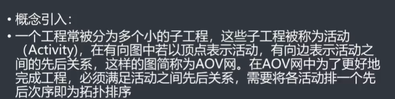
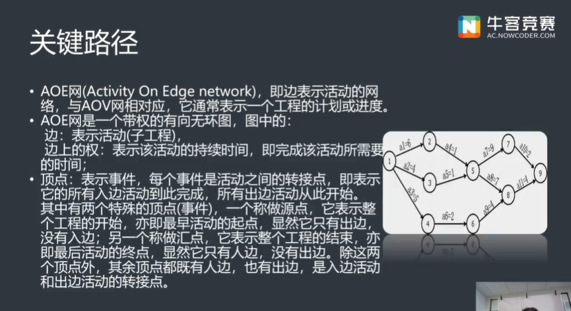
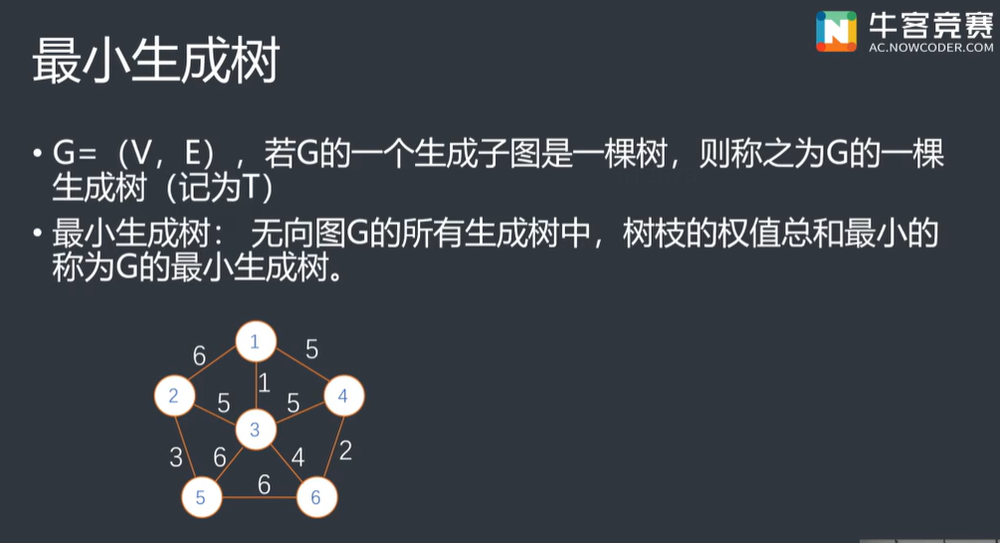

# 图的基本术语


# 图的存储

## 邻接矩阵

直接用**二维数组**存储（可以表示有向图或无向图）

>优点：简单直接、编程简单、查找某条边速度快，复杂度为O(1)，适合稠密图
>
>缺点：存储稀疏图的时候十分浪费空间，边有多个权值时不能存储，即不能存储重边。

## 邻接表

所谓邻接表，就是每个节点只存储它的邻居，一般用链表存储这些邻居。规模大的稀疏图一般用邻接表，因为非直连的节点不用存储，所以节省了空间，复杂度为O(n+m),n为节点数量，m为边数。几乎达到了最优复杂度。

常用vector实现邻接表

```c++
struct edge{
    int from, to, w;
    edge(int a, int b, int c){from = a; to = b; w = c;}
};
vector<dege>e[N];// 二维结构体数组
// 初始化
	for(int i=1; i<=n; i++){
        e[i].clear();
    }
// 存边
e[a].push_back(edge(a,b,c));// 把(a,b)存到节点a的邻接表中
// 遍历节点u的所有邻居
for(int i=0; i< e[u].size();i++){// 节点u的邻居有e[u].size()个
    // 简单写法for(int v : e[u])
    int v = e[u][i].to, w = e[u][i].w;
    ...
}
```

## 链式前向星

基本结构

```C++
const int maxn = 1e4;// 节点数
const int maxm  =1e5;// 边数
int cnt;// 标记已经记录的多少条边
struct edge{
    int to;// 这条边的终点
    int w;// 权重
    int next;// 以某一个点为起点的上一条边的编号(下标数)
}edges[maxm];
int head[maxn];// 存储以某个点为起点的最后一条边的编号 
```

存储下来的结构类似邻接链表，只不过是拿静态数组模拟，提高资源利用；

基本使用结构

```C++
void addedge(int x, int y, int z ){
    // 传入x, y, z分别为起点，终点，距离
    // tot为edge大小迭代器
    edge[++tot].l = z;
    edge[tot].t = y;
    edge[tot].next = head[x];
    // 记录每个节点邻接链表的起始位置
    head[x] = tot;
}
```


------

==无向图==存在欧拉回路的充要条件

当且仅当该图所有**顶点度数的都为偶数**，且该图是**连通图**

==有向图==存在欧拉回路的充要条件

所有顶点的**入度等于出度**且该图是**连通图**

# 拓扑排序



从有向图中选取一个没有前驱的顶点，并输出；

从有向图中删去此顶点以及所有以它为尾的弧；

重复上述两步，直至图空，或者图不空但找不到无前驱的顶点为止，没有前驱---入读为零，删除顶点及以它为尾的弧---弧头顶点的入读减1。

**拓扑排序是可能有多解的**， 要注意一边给输出当前点，一边更新其他点的入度。

## 拓扑排序的作用

判断一个有向图中是否有环，无环的图所有点都能进行拓扑排序。




混合图，图中有有向边，有的是无向边。

# 最短路


## Dijkstra算法

典型的单源最短路径算法，用于计算一个节点到其他所有节点的最短路径。**主要特点**是以起始点为中心向外层层扩展，直到扩展到终点为止。

> 注意该算法要求图中不存在负权边。


算法过程

1. 在开始之前，认为所有的点都没有进行过计算，dis[]全部赋值为极大值（`dis[]`表示各点当前到源点的最短距离）
2. 源点的`dis`明显为0
3. 计算与s相邻的所有点的`dis`值-------`dis[v] = map[s][v]`
4. 还没算出最短路的点中dis[]最小的一个点u，其最短路就是当前的`dis[u]`
5. 对于与u相连的所有点v，若`dis[v] = map[u][v]`比当前的`dis[v]`小，更新`dis[v]`
6. 重复4，5直到源点到所有点的最短路都已求出

> 算法适用于无向图，但不适合有负权边的图。


## Bellman-Ford算法

为了能够求解含负权边的带权有向图的单源最短路径问题，Bellman和Ford提出了从源点逐次绕过其他顶点，以缩短到达终点的最短路径长度的方法。

枚举多有的点，能松弛就进行松弛操作知道所有的点都不能松弛了

> 要求图中不能包含权值总和为负值回路。

Bellman-Ford算法的队列优化-------SPFA

每一次松弛的时候Bellman-Ford都要枚举所有的点，而其实有很多点都是不需要枚举的，所以有很多的无效枚举，于是效率显得略低

其实每次松弛的时候只需要枚举与上次被松弛的点相连的点就可以了

于是就有了SPFA

SPFA算法的实现

1. 设Dist代表S到I点的单前最短距离，Fa代表S到I的当前最短路径中I点之前的一个点的编号。开始时Dist全部为正无穷，只有Dist[S] = 0，Fa全部为0；
2. 每次迭代，取出队头的点v，依次枚举从v出发的边v->u，设边的长度为len，判断Dist[v]+len是否小于Dist[u]，若小于则改进Dist[u]，将Fa[u]记为v，并且由于S到u的最短距离变小了，有可能u可以改进其他的点，所以若u不在队列中，就将它放入队尾。这样一直迭代下去直到队列变空，也就是S到所有节点的最短距离都确定下来，结束算法。 若一个点入队次数超过n，则有负权环。

形式上与广搜非常类似，不同的是SPFA中一个点可能在出队列之后再次被放入队列，也就是一个点改进过其他的点之后，过了一段时间可能本身被改进，于是再次用来改进其他的点，这样反复迭代下去。

## Floyd算法

假设求从顶点vi到vj的最短路径。如果从vi到vj有弧，则从vi到vj存在一条长度为const[i,j]的路径，该路径不一定是最短路径，尚需记进行n次试探

可以求多源点最短路

**求最短路径**

- 动态规划思想
- F[i,j]表示i到j的经过小于k的点所能得到的临时最短路
- 枚举所有中转点k
- `if(f[i][k]+f[k][j]<=f[i][j]) f[i][j]=f[i][k]+f[k][j]`

```C++
// 标准模板
for(int k = 1; k <= n; k++){
    for(int i = 1; i <= n; i++){
        for(int j = 1; j <= n; j++){
			if((i !+ j)&&(j != k)&&(k != i)){
                if(f[i][k]+f[k][j]<=f[i][j])
                    f[i][j]=f[i][k]+f[k][j];
            }
        }
    }
}
```


# 最小生成树



 ## Prim算法

- 贪心准则
  - 加入后仍形成树，且耗费最小

- 算法过程

  - 从单一顶点的树T开始

  - 不断加入耗费最小的边（u，v），使T U {（u，v）}仍为树  ------u、v中有一个已经在T中，另一个不在T中


## K

