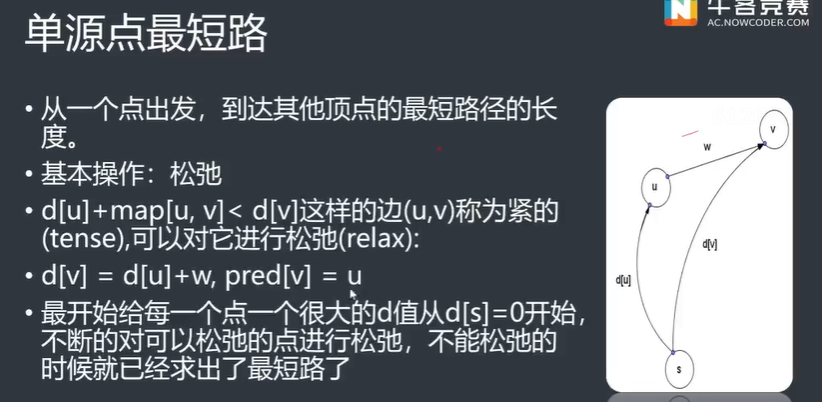

# 图的基本术语


## 并查集

```C++
// 直接上代码
#include<bits/stdc++.h>
using namespace std;

const int N = 2e5+10;
int s[N];

void init(){// 初始化// 可以直接用iota代替
    for(int i=0;i<N;i++) s[i] = i;// 初始花函数
}

int find(int x){ // 查询是否在同一个集合中
    if(x==s[x]){
        return x;
    }
    else {
        s[x] = find(s[x]);// 路径压缩
        return s[x];
    }
    // return x==s[x]? x : find(s[x]);
}

void unione(int x, int y){// 合并两个集合
    x = find(x);
    y = find(y);
    if(x!=y){
        s[x] = s[y];
    }
}

void slove(){
    int z, x, y;
    scanf("%d%d%d",&z, &x, &y);
    if(z == 2){
        if(find(x)==find(y)){
            printf("Y\n");
        }
        else printf("N\n");
    } else {
        unione(x, y);
    }
}

signed main(){
    //init();
    iota(s, s+N,0);
    int n, m;
    scanf("%d%d",&n,&m);
    while(m--){
        slove();
    }
    return 0;
}
```


## 容斥原理

```C++
/// 容斥原理求三个矩形的交集的面积
#include<bits/stdc++.h>
using namespace std;
#define ll long long
// 计算面积函数 - 输入两顶点坐标，返回面积
ll area(vector<int>& point1, vector<int>& point2){  
    if(point1[0]>=point2[0] || point1[1]>=point2[1]){	// 两“顶点”间无有效面积
        return 0LL; // long long类型的0
    }
    ll longth = point2[0]-point1[0];
    ll width = point2[1]-point1[1];
    return longth*width;
}

// 计算两矩形重叠面积 - 输入两组矩形顶点，返回面积
ll double_area(vector<vector<int>>& a, vector<vector<int>>& b){ 
    vector<int> point1(2), point2(2);	// "重叠部分"的左下角和右上角顶点
    point1[0] = max(a[0][0], b[0][0]);
    point1[1] = max(a[0][1], b[0][1]);
    point2[0] = min(a[1][0], b[1][0]);
    point2[1] = min(a[1][1], b[1][1]);
    return area(point1, point2);
}

// 计算三矩形重叠面积 - 输入三组矩形顶点，返回面积
ll triple_area(vector<vector<int>>& a, vector<vector<int>>& b, vector<vector<int>>& c){ 
    vector<int> point1(2), point2(2);
    point1[0] = max(max(a[0][0], b[0][0]), c[0][0]);
    point1[1] = max(max(a[0][1], b[0][1]), c[0][1]);
    point2[0] = min(min(a[1][0], b[1][0]), c[1][0]);
    point2[1] = min(min(a[1][1], b[1][1]), c[1][1]);
    return area(point1, point2);
}

// 解题函数
void solve(){
    vector<vector<vector<int>>> vertices(3, vector<vector<int>> (2, vector<int>(2)));	// 定义三维向量存储矩形信息 分别对应 【矩阵】【顶点】【横/纵坐标】 
    for(int i=0; i<3; i++){
        for(int j=0; j<2; j++){
            cin>>vertices[i][j][0]>>vertices[i][j][1];	// 输入矩阵顶点坐标信息
        }
    }
    ll ans=0;
    ans += area(vertices[0][0], vertices[0][1]) + area(vertices[1][0], vertices[1][1]) + area(vertices[2][0], vertices[2][1]);
    ans -= double_area(vertices[0], vertices[1]) + double_area(vertices[2], vertices[1]) + double_area(vertices[0], vertices[2]);
    ans += triple_area(vertices[0], vertices[1], vertices[2]);
    cout<<ans;
    return;
}

int main() {
	ios::sync_with_stdio(false);// 禁止cin与scanf混用，加快cin/cout效率
    cin.tie(nullptr);// 取消cin和cout之间的关联
    
	solve();
	return 0;
}
```


# 图的存储

## 邻接矩阵

直接用**二维数组**存储（可以表示有向图或无向图）

>优点：简单直接、编程简单、查找某条边速度快，复杂度为O(1)，适合稠密图
>
>缺点：存储稀疏图的时候十分浪费空间，边有多个权值时不能存储，即不能存储重边。

## 邻接表

所谓邻接表，就是每个节点只存储它的邻居，一般用链表存储这些邻居。规模大的稀疏图一般用邻接表，因为非直连的节点不用存储，所以节省了空间，复杂度为O(n+m),n为节点数量，m为边数。几乎达到了最优复杂度。

常用vector实现邻接表

```c++
struct edge{
    int from, to, w;
    edge(int a, int b, int c){from = a; to = b; w = c;}
};
vector<dege>e[N];// 二维结构体数组
// 初始化
	for(int i=1; i<=n; i++){
        e[i].clear();
    }
// 存边
e[a].push_back(edge(a,b,c));// 把(a,b)存到节点a的邻接表中
// 遍历节点u的所有邻居
for(int i=0; i< e[u].size();i++){// 节点u的邻居有e[u].size()个
    // 简单写法for(int v : e[u])
    int v = e[u][i].to, w = e[u][i].w;
    ...
}
```

## 链式前向星

基本结构

```C++
const int maxn = 1e4;// 节点数
const int maxm  =1e5;// 边数
int cnt;// 标记已经记录的多少条边
struct edge{
    int to;// 这条边的终点
    int w;// 权重
    int next;// 以某一个点为起点的上一条边的编号(下标数)
}edges[maxm];
int head[maxn];// 存储以某个点为起点的最后一条边的编号 
```

存储下来的结构类似邻接链表，只不过是拿静态数组模拟，提高资源利用；

基本使用结构

```C++
void addedge(int x, int y, int z ){
    // 传入x, y, z分别为起点，终点，距离
    // tot为edge大小迭代器
    edge[++tot].l = z;
    edge[tot].t = y;
    edge[tot].next = head[x];
    // 记录每个节点邻接链表的起始位置
    head[x] = tot;
}
```


------

==无向图==存在欧拉回路的充要条件

当且仅当该图所有**顶点度数的都为偶数**，且该图是**连通图**

==有向图==存在欧拉回路的充要条件

所有顶点的**入度等于出度**且该图是**连通图**

# 拓扑排序


从有向图中选取一个没有前驱的顶点，并输出；

从有向图中删去此顶点以及所有以它为尾的弧；

重复上述两步，直至图空，或者图不空但找不到无前驱的顶点为止，没有前驱---入读为零，删除顶点及以它为尾的弧---弧头顶点的入读减1。

**拓扑排序是可能有多解的**， 要注意一边给输出当前点，一边更新其他点的入度。


拓扑排序的代码：

```markdown
```


## 拓扑排序的作用

判断一个有向图中是否有环，无环的图所有点都能进行拓扑排序。


混合图，图中有有向边，有的是无向边。

# 最短路




## Dijkstra算法

典型的单源最短路径算法，用于计算一个节点到其他所有节点的最短路径。**主要特点**是以起始点为中心向外层层扩展，直到扩展到终点为止。

> 注意该算法要求图中不存在负权边。

算法过程

1. 在开始之前，认为所有的点都没有进行过计算，dis[]全部赋值为极大值（`dis[]`表示各点当前到源点的最短距离）
2. 源点的`dis`明显为0
3. 计算与s相邻的所有点的`dis`值-------`dis[v] = map[s][v]`
4. 还没算出最短路的点中dis[]最小的一个点u，其最短路就是当前的`dis[u]`
5. 对于与u相连的所有点v，若`dis[v] = map[u][v]`比当前的`dis[v]`小，更新`dis[v]`
6. 重复4，5直到源点到所有点的最短路都已求出

> 算法适用于无向图，但不适合有负权边的图。

```markdown
P市有n个公交站，之间连接着m条道路。P市计划新开设一条公交线路，该线路从城市的东站（s点）修建到西站（t点），请为P市设计一条满足上述条件并且最短的公交线路图。

**输入描述**:
	第一行有4个正整数n，m，s，t。

	接下来m行，每行3个数a,b,v描述一条无向道路a——b，长度为v。
**输出描述**:
	如果有解，输出一行，表示满足条件的最短公交线路的长度c。

	否则，输出“-1”
```

```C++
// Dijkstra 模板算法
#include<bits/stdc++.h>
using namespace std;
int n, m, s, t, tot = 0;
// head用来实现邻接表的一部分
// 存储每个顶点的链表的头节点信息
int head[1020];
// 记录每个节点的邻接链表的起始位置，
// 这个链表包含了与该节点直接相连的所有节点。
struct ty
{   // 存储节点
    // 链式前向星的存储方式
    int t, l, next;
    // t为尾部
    // l为距离
    // next为头节点
}edge[20010];

// 添加节点函数
void addedge(int x, int y, int z ){
    edge[++tot].l = z;
    edge[tot].t = y;
    edge[tot].next = head[x];
    // 记录每个节点邻接链表的起始位置
    head[x] = tot;
}

struct ty2
{
    int x, dis;

    bool operator < (const ty2 &a) const{
        return dis > a.dis;
    }
};

priority_queue<ty2> q;
int dis[1020];// 到起点的最短距离是多少
bool vis[1020];// 是否被搜索
int dij(int s, int t){
    // 初始化距离为极大值
    memset(dis, 0x3f, sizeof(dis));
    memset(vis, 0, sizeof(vis));

    dis[s] = 0;// 从s点开始
    ty2 tmp;
    tmp.x = s, tmp.dis = 0;
    q.push(tmp);
    while(!q.empty()){// bfs
        ty2 tmp = q.top();
        q.pop();
        
        if(vis[tmp.x]) continue;
        // 标记
        vis[tmp.x] = 1;
        // 搜索这个点的所有路径
        for(int i = head[tmp.x]; i != -1; i=edge[i].next){
            int y = edge[i].t;
            if(vis[y])continue;
            if(dis[y] > dis[tmp.x]+edge[i].l){
                dis[y] = dis[tmp.x]+edge[i].l;
                // 插入队列
                ty2 tmp2;
                tmp2.x = y;
                tmp2.dis = dis[y];
                q.push(tmp2);
            }
        }
    }

    if(dis[t] == 0x3f3f3f3f) return -1;
    return dis[t];
}

// P市有n个公交站，之间连接着m条道路。
// P市计划新开设一条公交线路，该线路从城市的东站（s点）修建到西站（t点）
// 请为P市设计一条满足上述条件并且最短的公交线路图。
int main(){
    // 无向图
    scanf("%d%d%d%d",&n,&m,&s,&t);

    memset(edge,-1,sizeof(edge));
    memset(head,-1,sizeof(head));

    for(int i = 1;i<=m;i++){// m条路
        int x, y, z;
        // x, y, z 表示 (起点，终点，距离)
        scanf("%d%d%d", &x, &y, &z);
        // 无向图，所以添加2次节点，来回
        addedge(x, y, z);
        addedge(y, x, z);
    }

    printf("%d\n", dij(s,t));
    return 0;
}
```


## Bellman-Ford算法

为了能够求解含负权边的带权有向图的单源最短路径问题，Bellman和Ford提出了从源点逐次绕过其他顶点，以缩短到达终点的最短路径长度的方法。

枚举多有的点，能松弛就进行松弛操作知道所有的点都不能松弛了

> 要求图中不能包含权值总和为负值回路。

Bellman-Ford算法的队列优化-------SPFA

每一次松弛的时候Bellman-Ford都要枚举所有的点，而其实有很多点都是不需要枚举的，所以有很多的无效枚举，于是效率显得略低

其实每次松弛的时候只需要枚举与上次被松弛的点相连的点就可以了

于是就有了SPFA

SPFA算法的实现

1. 设Dist代表S到I点的单前最短距离，Fa代表S到I的当前最短路径中I点之前的一个点的编号。开始时Dist全部为正无穷，只有Dist[S] = 0，Fa全部为0；
2. 每次迭代，取出队头的点v，依次枚举从v出发的边v->u，设边的长度为len，判断Dist[v]+len是否小于Dist[u]，若小于则改进Dist[u]，将Fa[u]记为v，并且由于S到u的最短距离变小了，有可能u可以改进其他的点，所以若u不在队列中，就将它放入队尾。这样一直迭代下去直到队列变空，也就是S到所有节点的最短距离都确定下来，结束算法。 若一个点入队次数超过n，则有负权环。

形式上与广搜非常类似，不同的是SPFA中一个点可能在出队列之后再次被放入队列，也就是一个点改进过其他的点之后，过了一段时间可能本身被改进，于是再次用来改进其他的点，这样反复迭代下去。

## Floyd算法

假设求从顶点vi到vj的最短路径。如果从vi到vj有弧，则从vi到vj存在一条长度为`const[i,j]`的路径，该路径不一定是最短路径，尚需记进行n次试探

可以求多源点最短路

**求最短路径**

- 动态规划思想
- F[i,j]表示i到j的经过小于k的点所能得到的临时最短路
- 枚举所有中转点k
- `if(f[i][k]+f[k][j]<=f[i][j]) f[i][j]=f[i][k]+f[k][j]`

```C++
// 标准模板
for(int k = 1; k <= n; k++){
    for(int i = 1; i <= n; i++){
        for(int j = 1; j <= n; j++){
			if((i !+ j)&&(j != k)&&(k != i)){
                if(f[i][k]+f[k][j]<=f[i][j])
                    f[i][j]=f[i][k]+f[k][j];
            }
        }
    }
}
```


# 最小生成树


 ## Prim算法

复杂度为O((n+m)logm)

- 贪心准则
  - 加入后仍形成树，且耗费最小。

- 算法过程

  - 从单一顶点的树T开始。

  - 不断加入耗费最小的边（u，v），使T U {（u，v）}仍为树  ------u、v中有一个已经在T中，另一个不在T中。

```markdown
	胡队长带领HA实验的战士们玩真人CS，真人CS的地图由一些据点组成，现在胡队长已经占领了n个据点，为了方便，将他们编号为1-n，为了隐蔽，胡队长命令战士们在每个据点出挖一个坑，让战士们躲在坑里。由于需要在任意两个点之间传递信息，两个坑之间必须挖出至少一条通路，而挖沟是一件很麻烦的差事，所以胡队长希望挖出数量尽可能少的沟，使得任意两个据点之间有至少一条通路，顺便，尽可能的∑d[i][j]使最小（其中d[i][j]为据点i到j的距离）。
**输入描述:**
	第一行有2个正整数n，m，m表示可供挖的沟数。
	接下来m行，每行3个数a,b,v，每行描述一条可供挖的沟，该沟可以使a与b连通，长度为v。
**输出描述:**
	输出一行，一个正整数，表示要使得任意两个据点之间有一条通路，至少需要挖长的沟。（数据保证有解）
```


```C++
// Prime 模板算法
#include<bits/stdc++.h>
using namespace std;
int n, m;
struct ty {
    int t, l, next;
}edge[2*500000+100];
int head[1000010];
int cnt = 0;
void addedge(int x, int y, int z){
    edge[++cnt].t = y;
    edge[cnt].l = z;
    edge[cnt].next = head[x];
    head[x] = cnt;
}
bool vis[100010];
struct ty2
{
    int x, len;
    bool operator < (const ty2 &a) const {
        return len > a.len;
    }
};
priority_queue<ty2> q;  
void prim(){
    vis[1] = 1;
    ty2 tmp;
    for(int i = head[1]; i != -1; i=edge[i].next){
        tmp.x = edge[i].t;
        tmp.len = edge[i].l;
        q.push(tmp);
    }
    int ans = 0;
    while(!q.empty()){
        ty2 tmp = q.top();
        q.pop();
        int x = tmp.x;
        if(vis[x])continue;
        vis[x]  = 1;
        ans+=tmp.len;
        for(int i = head[x]; i != -1; i=edge[i].next){
            if(vis[edge[i].t])continue;
            tmp.x = edge[i].t;
            tmp.len = edge[i].l;
            q.push(tmp);
        }
    }
    cout << ans << endl;
}
int main(){
    cin >> n >> m;
    memset(head,-1,sizeof(head));
    for(int i = 1;i<= m;i++){
        int a, b, v;
        cin >> a >> b >> v;
        addedge(a,b,v);
        addedge(b,a,v);
    }
    prim();
    return 0;
}
```


## Kruskal算法

复杂度为O(m*log(m))

算法思想：**贪心**选取最短的边来组成一棵最小生成树。

具体做法：先将所有的边做排序，然后利用**并查集**作判断，来优先选择较小的边（使用优先队列来存储），直到建成一棵生成树。

需要用结构体来存储（存起点，终点，权值），按权值进行结构体排序。


