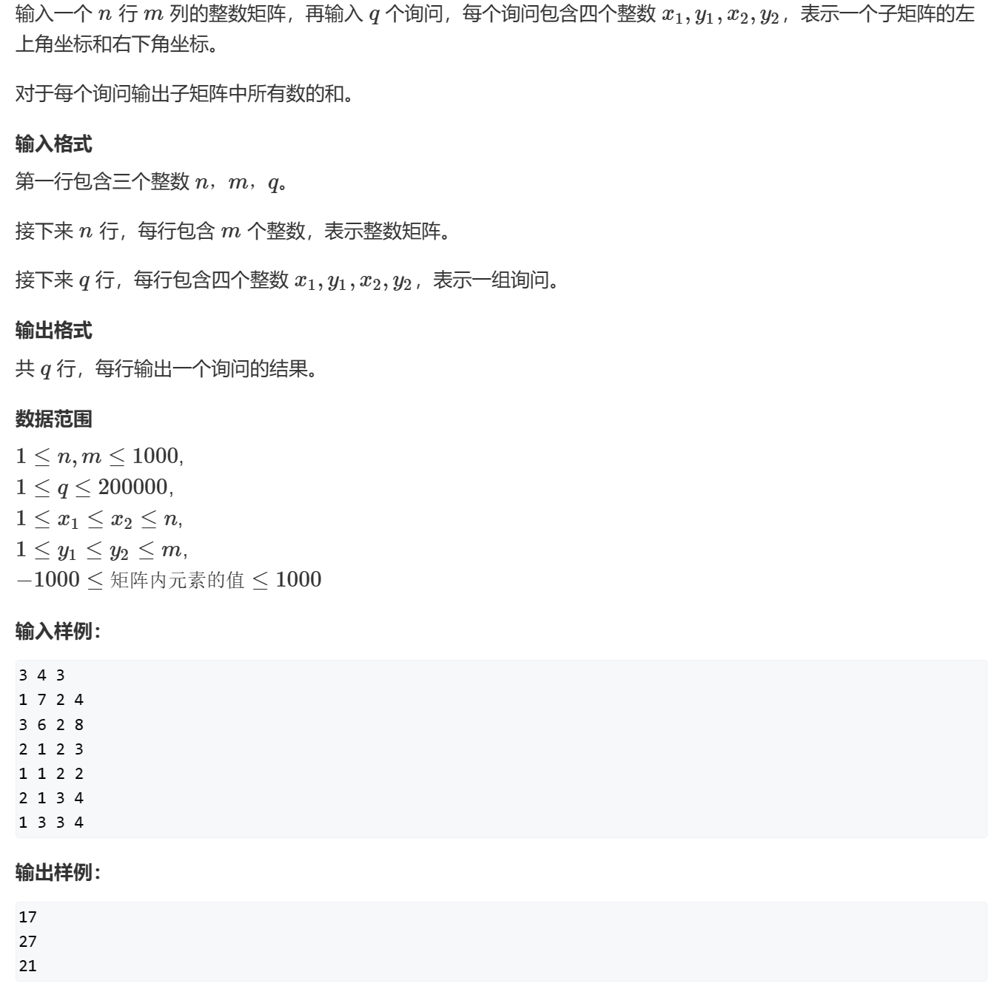

# 前缀和和差分

## 一维前缀和

思路：就构建一个数组，数组的下标为i的元素为原数组的下标为0~i的元素

####  #这里用这道题来给出**例子**


```C++
#include<bits/stdc++.h>
using namespace std;
typedef long long LL;
const LL N=100010;
int main(){
    LL s[N];
    LL qianzuihe[N];
    LL a,b;
    //qianzuihe[0]=0;//如果开全局的话不需要初始化，系统会自动初始化为0
    cin >> a >> b;
    for(LL i=1;i<=a;i++){
        cin >> s[i];
        qianzuihe[i]=s[i]+qianzuihe[i-1];
    }
    while(b--){
        LL x,y;
        cin >> x >> y;
        cout<<qianzuihe[y]-qianzuihe[x-1]<<endl;
    }
    return 0;
}
```

## 二维前缀和


#### #这里简单用两个图来表示二维前缀和的思想，比较抽象，可以自己根据自己的想法在纸上画一下就会明白了

还是用一个例题来解释，例题的思想为图里的第二个图



##### 代码采用C++语言，有C语言基础也能看懂

```C++
#include<iostream>
using namespace std;
const int N=1010;
int main(){
    int n,m,q;
    int s[N][N];
    cin >> n >> m >> q;
    for(int i=1;i<=n;i++){
        for(int j=1;j<=m;j++){
            cin >> s[i][j];
        }
    }
    for(int i=1;i<=n;i++){
        for(int j=1;j<=m;j++){
            s[i][j]+=s[i-1][j]+s[i][j-1]-s[i-1][j-1];
        }
    }
    while(q--){
        int x1,x2,y1,y2;
        cin >> x1 >> y1 >> x2 >> y2;
        cout<<s[x2][y2]-s[x1-1][y2]-s[x2][y1-1]+s[x1-1][y1-1]<<endl;
    }    
    return 0;
}
```

