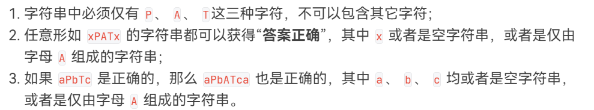
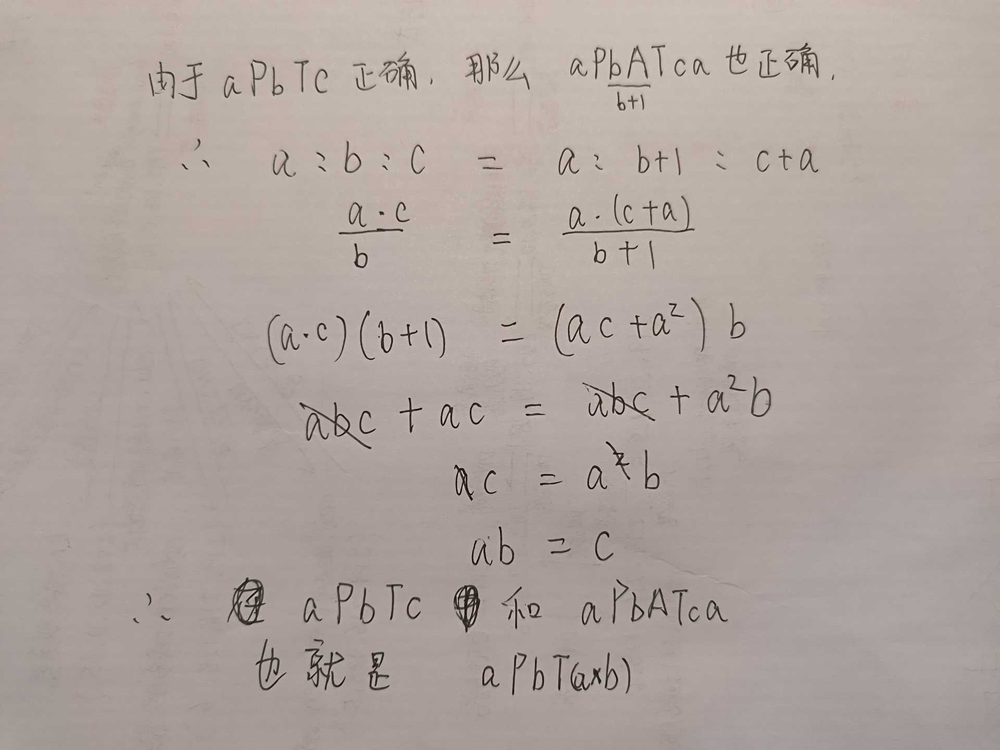

# 题解

核心就这几个条件上

第一个条件告诉我们，==Yes的字符串只能有  P A T  这三种字符==，不能包含其他字符

第二个条件中，==x是一个字符串，可以是空串，也可以是任意长度的由A字符组成的串==，`xPATx` 意思是，==PAT前后的x是相同的字符串==。

第三个条件是，在`aPbTc`正确的前提下，`aPbATca`也一定是正确的。

那么就成立一个数学比例，`a:b:c == a:b+1:c+a` 化简就得到了 `c == a * b`  到这里，结果就出来了

